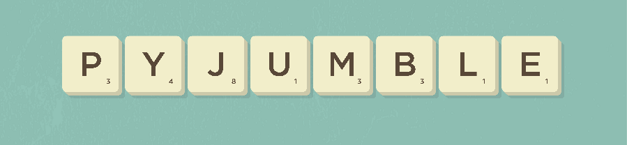
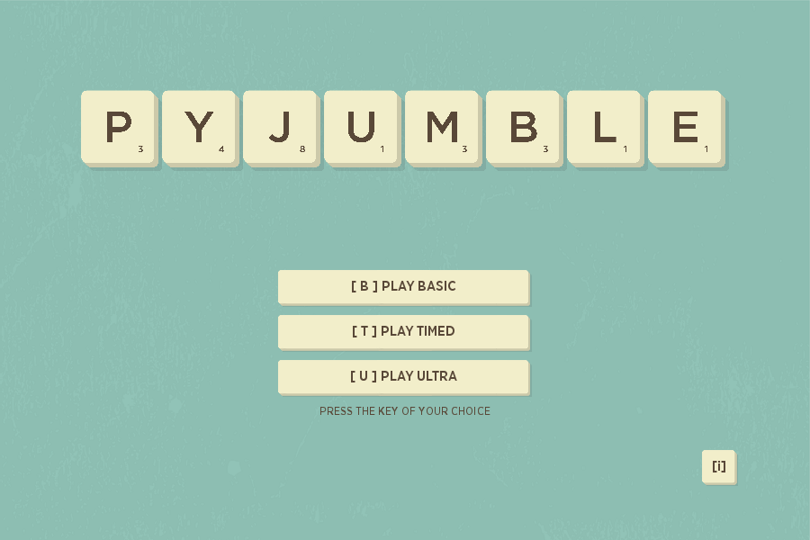
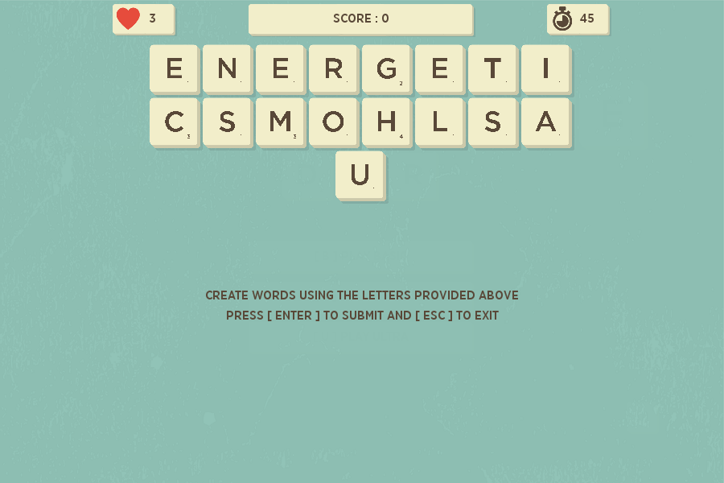
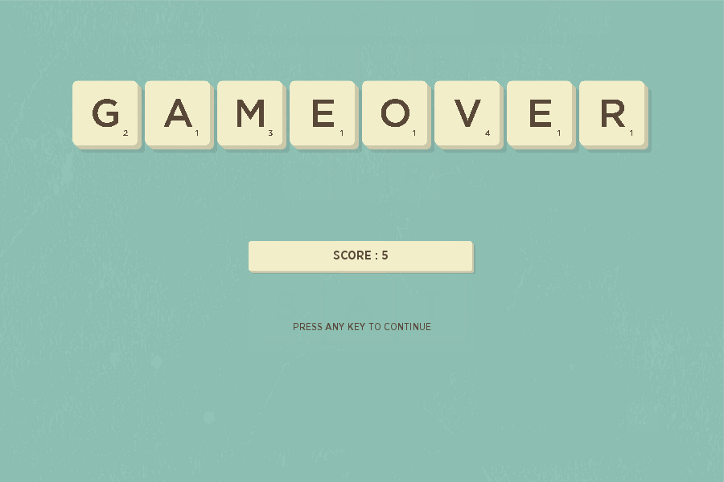

<h1 align="center">PyJumble: Powered by PyGame</h1>
<p align="center">
    A Python Based Word Unscramble Game<br><br>
    
</p>


## Installation

* Download the **[latest release](https://github.com/GerardBalaoro/PyJumble/releases)**
* Unpack the **zip file** or run the installer if you downloaded packaged binaries for your Operating System

### Running From Source

Downloading the source code gives you freedom to configure the game. If you opted to do so, run the application through the following steps:

1. Install **[PyGame](https://www.pygame.org/)**
   ```
   pip install pygame
   ```

2. Run the main script
   ```
   python main.py
   ```
   > **Note**: This version of the program has only been tested in Python 3.4 to 3.7


## Game Play

* **Casual** 
   - The player has 3 lives and must guess as much valid word to earn points.
   - Invalid words and duplicate answers will deduct 1 life from the player.
* **Timed**
   - The player must guess as much valid word to earn points within 60 seconds.
* **Hyper**
   - A combination of casual and timed mode.
* **Anagram Finder**
   - The player must find all the anagrams from a selection of characters.


## Dictionaries

* **Dictionary**
   - Default dictionary file
* **Enable**
   - The official word list for Words With Friends
   - Retrieved from [Word Game Dictionary](https://www.wordgamedictionary.com/enable/)
* **SOWPODS**
   - The word list used in Scrabble tournaments in English speaking countries except United States, Canada, Thailand and Israel
   - Retrieved from [Word Game Dictionary](https://www.wordgamedictionary.com/SOWPODS/)
* **TWL06**
   - Official Tournament and Club Word List
   - Used as primary source on Scrabble tournaments in the United States, Canada, and Thailand
   - Retrieved from [Word Game Dictionary](https://www.wordgamedictionary.com/twl06/)

> The Dictionary File can be configured in **([config.json](config.json))**.


## Documentation

* [Code Documentation](docs/Documentation.md)


## Screenshots

<p align="center">
    
    
    
    
</p>


## License

Copyright © 2018 Gerard Balaoro 

Permission is hereby granted, free of charge, to any person obtaining a copy of this software and associated documentation files (the "Software"), to deal in the Software without restriction, including without limitation the rights to use, copy, modify, merge, publish, distribute, sublicense, and/or sell copies of the Software, and to permit persons to whom the Software is furnished to do so, subject to the following conditions: 

The above copyright notice and this permission notice shall be included in all copies or substantial portions of the Software. 

THE SOFTWARE IS PROVIDED "AS IS", WITHOUT WARRANTY OF ANY KIND, EXPRESS OR IMPLIED, INCLUDING BUT NOT LIMITED TO THE WARRANTIES OF MERCHANTABILITY, FITNESS FOR A PARTICULAR PURPOSE AND NONINFRINGEMENT. IN NO EVENT SHALL THE AUTHORS OR COPYRIGHT HOLDERS BE LIABLE FOR ANY CLAIM, DAMAGES OR OTHER LIABILITY, WHETHER IN AN ACTION OF CONTRACT, TORT OR OTHERWISE, ARISING FROM, OUT OF OR IN CONNECTION WITH THE SOFTWARE OR THE USE OR OTHER DEALINGS IN THE SOFTWARE.


## Credits

* Interface Based on Graphic by **[Vecteezy](https://www.vecteezy.com)**
* [YIPPEE by **Snabisch**](https://opengameart.org/content/yippee)
* [Happy Tune by **syncopica**](https://opengameart.org/content/happy-tune)
* Other Sounds are Generated using **[Diforb](http://diforb.com)**
* Hearts Icon by **[Smashicons](https://smashicons.com/)** from www.flaticon.com
* Three quarters of an hour Icon by **[Freepik](http://www.freepik.com/)** from www.flaticon.com
* The Code Structure as Based on Jumpy Platformer by **[KidsCanCode](http://kidscancode.org/)**
